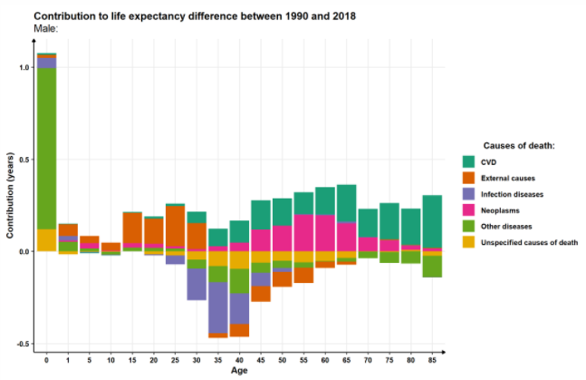

## [Study report on demography in Samara region](https://rawcdn.githack.com/Ramrion/Samara-demography/df037b5dc602a62a139353bfa1452e547b88d247/Samara_demography_report.html)

 Covering changes in the population structure, age-specific mortality, fertility, and decomposition of life expectancy by reasons of death for the period 1990-2019

## Source of data:
[РосБРиС](http://demogr.nes.ru/en/demogr_indicat/data)
